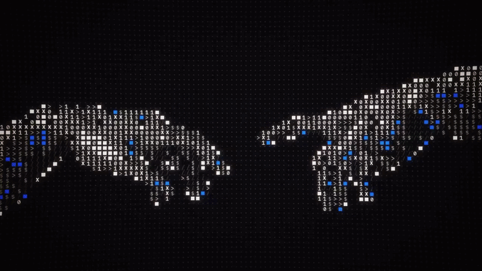
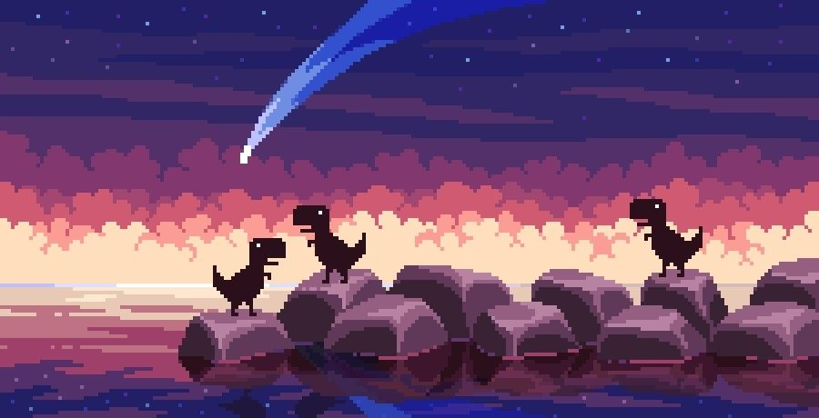
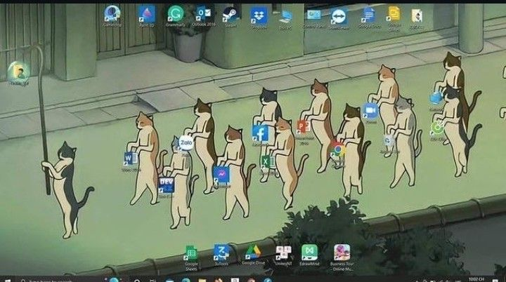

<div align="center">



# ᴘʀᴀᴠᴇᴇɴ ᴋᴏᴛɪᴘᴀʟʟɪ

### `Software Developer` • `Salesforce Developer` • `WHAT NOT?!`


</div>

---

# > whoami

```text
Most people see an inconvenience.

I see software waiting to be written.

Whether it's discovering hackathons,
matching resumes to jobs,
or building AI-powered tools,

I enjoy turning

    "Someone should build this."

into

    "I already did."

Every project teaches something.
Every problem deserves a better solution.
```

---


---

<h2 align="center">⚡ Tech Arsenal</h2>

<p align="center">


</p>

---

# > current_mission

```text
███████████████████████████░░░░░░░░░░░░ 65%

✔ Build Orbit
✔ AI Resume Analyzer
✔ AI Job Matching
✔ Tech Events Platform

□ Reach 1000+ Developers
□ Contribute to Open Source
□ Ship Products Every Month
```

---



---

# > deployed_projects

<table>

<tr>

<td width="50%">


### 🚀 Orbit

Discover **Hackathons**, **Jobs**, **Tech Events**, **Conferences** and Opportunities in one place.

`Next.js` • `TypeScript` • `PostgreSQL` • `AI`

<p>

<a href="YOUR_GITHUB_REPO">


</a>

<a href="YOUR_DEMO">


</a>

</p>

</td>

<td width="50%">


### 🤖 AI Resume Analyzer

Analyze resumes, improve ATS score and receive AI-powered suggestions.

`React` • `Node.js` • `OpenAI`

<p>

<a href="#">


</a>

<a href="#">


</a>

</p>

</td>

</tr>

<tr>

<td width="50%">


### 💬 AI Copilot

Developer assistant powered by modern LLMs and intelligent automation.

`Next.js` • `AI`

<p>

<a href="#">


</a>

<a href="#">


</a>

</p>

</td>

<td width="50%">


### 🛒 Commerce Hub

Modern headless commerce platform built with scalable architecture.

`Next.js` • `Node.js`

<p>

<a href="#">


</a>

<a href="#">


</a>

</p>

</td>

</tr>

</table>

---

# > github_stats

<div align="center">


<br><br>


</div>

---

# > achievements

<div align="center">


</div>

---

# > system.info

```yaml
Name:           Praveen Kotipalli
Role:           Full Stack Developer
Focus:          AI Products
Current Build:  Orbit
Status:         Building
Coffee:         Required
Music:          Always
Editor:         VS Code
OS:             Windows + Linux
Mission:        Build products used by millions.
```

---



---

# > establish_connection()

<div align="center">

<a href="https://github.com/YOUR_USERNAME">

</a>

<a href="https://linkedin.com/in/YOUR_LINKEDIN">

</a>

<a href="mailto:YOUR_EMAIL">

</a>

<a href="YOUR_PORTFOLIO">

</a>

</div>

---

# > contribution_graph

<p align="center">


</p>

---

<div align="center">

```text
if (you_like_building_cool_things) {

    connect();
    collaborate();
    create();

}
```

### **See you in the next commit.**


</div>
